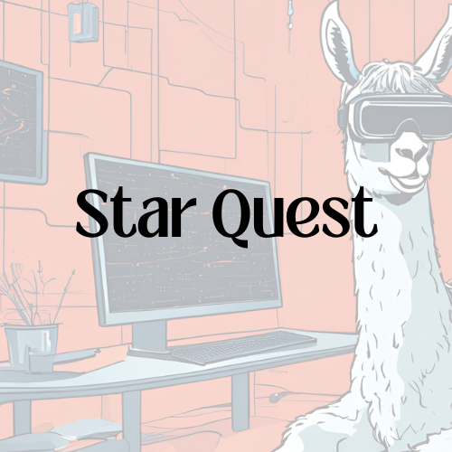

<div align="center">



# 🌌 Star Quest: A Sci-Fi Text Adventure Game 🌌

</div>

Welcome to **Star Quest**, a thrilling, AI-powered sci-fi text adventure game I created for the **School of Open Source Challenge**. This game blends ancient myths with futuristic space adventures, and thanks to AI, the story evolves based on the decisions *you* make. Dive in for an immersive journey where every choice shapes your destiny!

## 🎥 Demo Video

Check out the demo of **Star Quest** on YouTube:  
[Watch the demo video here!](https://youtu.be/nRTH8Hzixas?si=tRtUJP7ebp3XQfjq)

## 🚀 What's Special About Star Quest?

- **Dynamic Storylines**: The story changes as you play, powered by LLaMA AI.

- **Create Your Own Character**: Customize your hero for an engaging and personal experience.

- **Multiple Adventures**: Explore different storylines each time you play.

- **Sci-Fi Theme & Soundtrack**: Enjoy an epic soundtrack while venturing through space.

- **Polished UI**: Sleek and responsive design for an immersive experience, built with Tailwind CSS.

## ✨ Features

- **LLaMA AI**: Generates real-time, adaptive storylines based on your choices.

- **Next.js**: A powerful React framework for smooth gameplay and routing.

- **React Hooks**: For managing game state and user interactions seamlessly.

- **Tailwind CSS**: A utility-first CSS framework for quick design and responsive layout.

## 🛠️ Tech Stack

- **Frontend**: Next.js, React.js, React Hooks

- **AI Model**: LLaMA API

- **UI/UX**: Tailwind CSS for design and responsiveness

## 📸 Screenshots

<div align="center">
  <div style="display: flex; flex-wrap: wrap; justify-content: center;">
    
    
    
    
    
  </div>
</div>

## 🎮 How to Play

1. Clone the repository:
   ```bash
   git clone https://github.com/YourUsername/StarQuest.git

2. Install dependencies:
   ```bash
   npm install

3. Start the game:
   ```bash
   npm run dev

## 💬 Feedback & Contribution

I'd love to hear your feedback on Star Quest! Feel free to open issues or contribute by submitting pull requests.